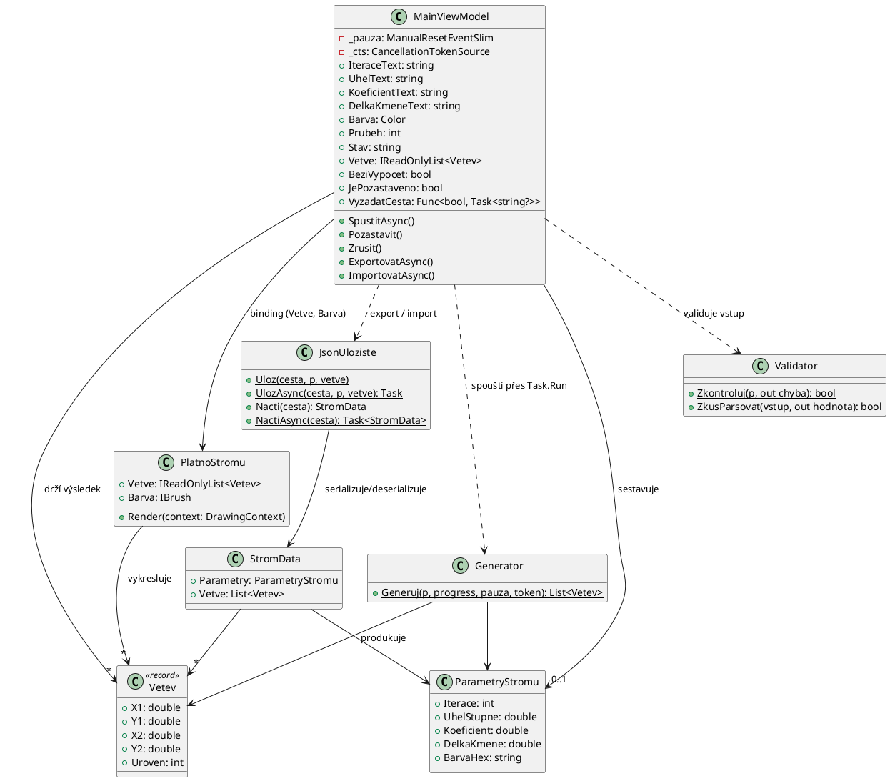
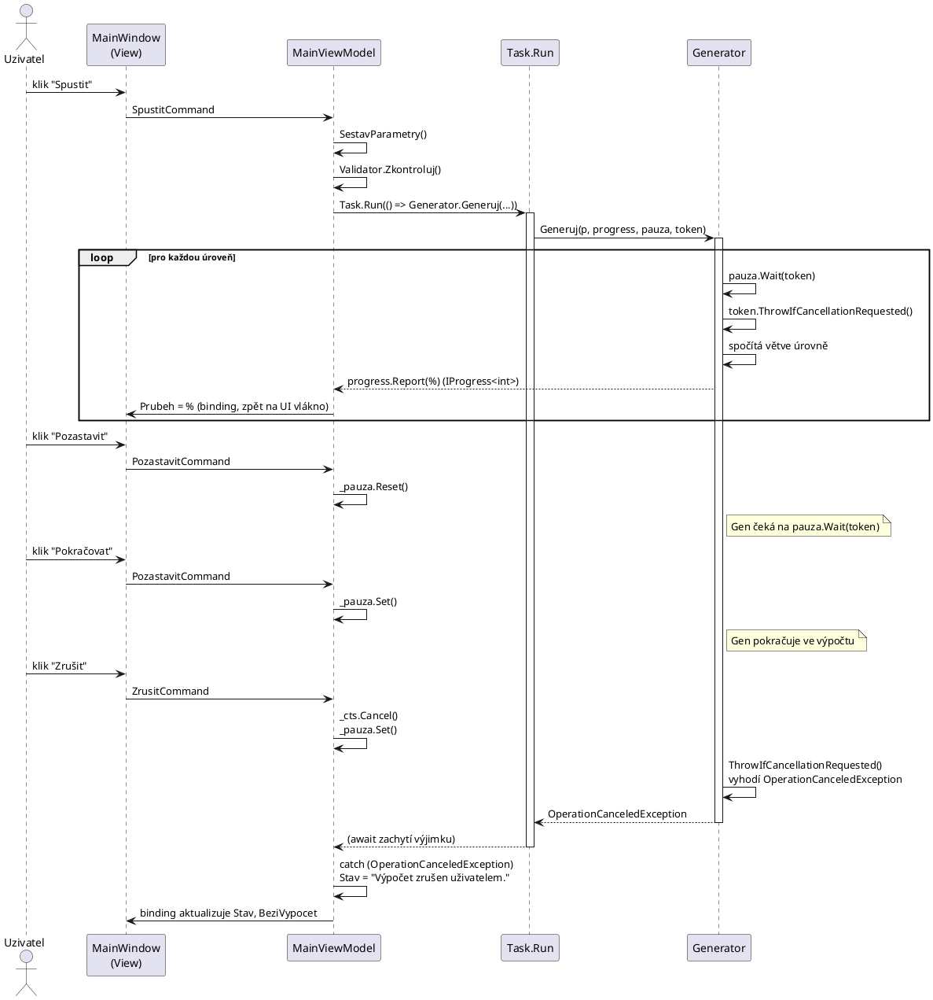

# Fraktální strom

Cvičné řešení ukázkové úlohy **II.1 — Generování fraktálního stromu** ze zadání
SZZVP, okruh [5 — Vývoj desktopové aplikace](../README.md).

## Co to je

- Desktopová aplikace s grafickým rozhraním, která generuje a vykresluje
  binární fraktální strom (fractal canopy) podle zadaných parametrů.
- Uživatel zadá počet iterací, úhel větvení, koeficient zkrácení, délku
  kmene a barvu větví, výpočet lze **spustit, pozastavit, znovu rozběhnout
  a zrušit**, GUI zůstává během výpočtu ovladatelné.
- Vygenerovaný strom lze **exportovat a znovu načíst** z JSON souboru.
- Řešení je rozdělené do tří projektů: `FraktalniStrom.Jadro` (doména, bez
  závislosti na GUI), `FraktalniStrom.App` (Avalonia GUI, MVVM) a
  `FraktalniStrom.Testy` (xUnit testy jádra).

## Jak spustit

Požadavky:

- **.NET 10 SDK** (vyvíjeno a ověřeno na SDK 10.0.400).

Příkazy (spouštět z této složky, kde je `FraktalniStrom.sln`):

```bash
# sestavení celého řešení
dotnet build

# spuštění GUI aplikace
dotnet run --project FraktalniStrom.App

# spuštění testů
dotnet test
```

## Uživatelská příručka

Okno aplikace má vlevo ovládací panel s formulářem, vpravo plochu, na které
se strom vykresluje.

### Formulář parametrů

| Pole | Význam | Platný rozsah |
|---|---|---|
| Počet iterací | Kolik úrovní větvení se má vygenerovat. | celé číslo **1 až 18** (včetně) |
| Úhel (°) | O kolik stupňů se každá dvojice potomků odklání od směru rodičovské větve. | **0 až 180**, obě krajní hodnoty **vyloučeny** |
| Koeficient zkrácení | Kolikrát se zkrátí délka větve v každé další úrovni oproti rodičovské. | **0 až 1**, obě krajní hodnoty **vyloučeny** |
| Délka kmene | Délka větve v úrovni 0 (kmene) v pixelech. | libovolné **kladné** číslo |
| Barva větví | Barva, kterou se strom vykreslí, vybírá se pomocí `ColorPicker`u. | formát `#RRGGBB` (`ColorPicker` vždy vrátí platnou hodnotu) |

Rozsahy odpovídají kontrole v `FraktalniStrom.Jadro/Validator.cs`. Horní mez
18 iterací je zvolená proto, že počet větví roste exponenciálně jako
2<sup>n</sup> − 1 (při 18 iteracích už je to přes 262 000 větví); nad tuto
hranici by výpočet a vykreslení zbytečně zatěžovaly paměť i čas. Když
zadaná hodnota rozsah poruší nebo se nedá naparsovat na číslo, aplikace
výpočet nespustí a do stavového řádku napíše konkrétní důvod (např. „Úhel
větvení musí být v rozsahu 0° až 180° (bez krajních hodnot).“).

### Ovládací tlačítka

1. **Spustit** — sestaví parametry z formuláře, ověří je a pokud jsou v
   pořádku, spustí generování na pozadí (mimo UI vlákno). Dokud výpočet
   běží, nejde spustit druhý souběžně.
2. **Pozastavit / Pokračovat** — jedno tlačítko, jehož text se mění podle
   stavu. Pozastavení výpočet zmrazí na konci aktuálně zpracovávané
   úrovně, opětovným stiskem (**Pokračovat**) se rozběhne dál od stejného
   místa.
3. **Zrušit** — trvale ukončí běžící výpočet (i pokud je zrovna
   pozastavený). Po zrušení stavový řádek ukáže „Výpočet zrušen
   uživatelem.“ a formulář je znovu připravený na nové spuštění.
4. **Exportovat JSON** — otevře dialog pro uložení souboru a zapíše do něj
   aktuální parametry i vygenerované větve. Dostupné, jen když už je co
   exportovat.
5. **Importovat JSON** — otevře dialog pro výběr souboru, načte z něj
   parametry a větve, vyplní jimi formulář a rovnou strom vykreslí.

### Progress bar a stavový řádek

- **Progress bar** ukazuje postup generování v procentech (0–100) —
  aktualizuje se po dokončení každé úrovně větvení, takže je vidět i u
  velkého počtu iterací.
- **Stavový řádek** pod ním hlásí, co aplikace právě dělá nebo co se
  stalo naposledy: probíhající generování, dokončení s počtem větví,
  pozastavení, zrušení, chybu validace nebo výsledek importu/exportu
  (včetně cesty k souboru).

## Proč Avalonia místo WPF

Vývoj i běh probíhaly na Linuxu, takže **WPF technicky nešlo použít** — WPF
je vázané na Windows (.NET Framework / .NET Windows Desktop runtime). Zadání
SZZVP-SW navíc v charakteristice okruhu žádá jen „aplikaci s grafickým
uživatelským rozhraním v jazyce C#“; WPF je zmíněný pouze v seznamu
„doporučených znalostí a dovedností“, ne jako povinná technologie.

Zvolená náhrada, **Avalonia**, je multiplatformní XAML framework pro .NET,
koncepčně velmi blízký WPF — stejný jazyk (XAML), stejný způsob práce
s bindingem, styly a MVVM. Rozdíly jsou hlavně v pojmenování a v tom, jak
jsou postavené pod kapotou:

| WPF | Avalonia | Poznámka |
|---|---|---|
| `.xaml` | `.axaml` | Jiná přípona, aby si vzájemně nekolidovaly nástroje (IntelliSense, designer). |
| `DependencyProperty` | `StyledProperty` / `DirectProperty` / `AttachedProperty` | Avalonia rozlišuje tři typy vlastností místo jednoho. |
| `Trigger` ve stylech | Pseudo-třídy a CSS-like selektory (`:pointerover`, `:pressed`) | Avalonia klasické triggery ve stylech nemá. |
| `Dispatcher.Invoke` | `Dispatcher.UIThread.InvokeAsync` / `Post` | Návrat na UI vlákno z jiného vlákna. |
| `OpenFileDialog` / `SaveFileDialog` | `StorageProvider.OpenFilePickerAsync` / `SaveFilePickerAsync` | Asynchronní a multiplatformní API pro souborové dialogy. |
| `OnRender(DrawingContext)` | `Render(DrawingContext)` | Vlastní kreslení controlu (v tomto projektu `PlatnoStromu`). |

Zdroj: <https://docs.avaloniaui.net/docs/migration/wpf/cheat-sheet>

Mimo tyto rozdíly v API jsou principy — deklarativní XAML, datový binding,
MVVM, příkazy (`ICommand`), událostmi řízené programování — mezi WPF a
Avalonií totožné, takže se látka u obhajoby dá vysvětlit i jako znalost WPF.

## Architektura / objektový návrh

Řešení je rozdělené do tří vrstev podle odpovědnosti, žádná logika není
v code-behind oken:

- **`FraktalniStrom.Jadro`** — doménová vrstva bez závislosti na GUI:
  - `ParametryStromu` — vstupní parametry generování (iterace, úhel,
    koeficient, délka kmene, barva).
  - `Vetev` — neměnný záznam (`record`) jedné úsečky stromu se souřadnicemi
    a úrovní zanoření.
  - `Generator` — statická třída s metodou `Generuj`, iterativně (po
    úrovních, ne rekurzivně) počítá geometrii stromu, podporuje hlášení
    průběhu (`IProgress<int>`), pozastavení (`ManualResetEventSlim`) a
    zrušení (`CancellationToken`).
  - `Validator` — kontrola platnosti `ParametryStromu` a bezpečné
    (nevyhazující) parsování textových vstupů z formuláře.
  - `JsonUloziste` — synchronní i asynchronní uložení/načtení stromu do a
    z JSON souboru.
  - `StromData` — DTO spojující `ParametryStromu` a seznam `Vetev` pro
    serializaci.
- **`FraktalniStrom.App`** — Avalonia GUI, MVVM:
  - `ViewModels/MainViewModel` — veškerá aplikační logika: sestavení
    parametrů z formuláře, validace, spuštění výpočtu přes `Task.Run`,
    reakce na pozastavení/zrušení, export/import.
  - `Views/MainWindow.axaml` — deklarace formuláře a rozvržení okna,
    binding na `MainViewModel`.
  - `Views/MainWindow.axaml.cs` — code-behind obsahuje **výhradně**
    napojení souborového dialogu (`StorageProvider.OpenFilePickerAsync` /
    `SaveFilePickerAsync`) na delegát `MainViewModel.VyzadatCestu`; žádná
    doménová ani aplikační logika zde není, aby zůstal `MainViewModel`
    testovatelný nezávisle na oknech Avalonia.
  - `Controls/PlatnoStromu` — vlastní kreslicí `Control`, který v metodě
    `Render(DrawingContext)` vykreslí seznam `Vetev`.
- **`FraktalniStrom.Testy`** — xUnit testy `FraktalniStrom.Jadro`.

## UML diagramy

### Diagram tříd

Diagram odpovídá skutečné struktuře tohoto řešení (Avalonia + MVVM), ne
obecné WPF variantě z README okruhu.



### Sekvenční diagram — asynchronní generování s pauzou a zrušením



## Splnění funkčních požadavků

| Požadavek z PDF | Kde je splněn |
|---|---|
| Zadání parametrů stromu včetně barvy | `Views/MainWindow.axaml` (formulář s `TextBox` a `ColorPicker`) → `ViewModels/MainViewModel.SestavParametry()` sestaví `FraktalniStrom.Jadro.ParametryStromu`; `FraktalniStrom.Jadro/Validator.Zkontroluj()` ověří rozsahy. |
| Zahájit / přerušit / pozastavit / znovu rozběhnout výpočet, GUI reaguje během výpočtu | `ViewModels/MainViewModel.SpustitAsync()` spouští `FraktalniStrom.Jadro/Generator.Generuj()` přes `Task.Run` (mimo UI vlákno); `MainViewModel.Pozastavit()` ovládá `ManualResetEventSlim`, `MainViewModel.Zrusit()` volá `CancellationTokenSource.Cancel()`; `Generator.Generuj()` respektuje obojí (`pauza.Wait(token)`, `token.ThrowIfCancellationRequested()`) po každé úrovni. |
| Export do JSON a načtení | `FraktalniStrom.Jadro/JsonUloziste.Uloz/UlozAsync` a `Nacti/NactiAsync`; volané z `ViewModels/MainViewModel.ExportovatAsync()` a `ImportovatAsync()`, cesta k souboru se získává přes `Views/MainWindow.axaml.cs.VyzadatCestuAsync()` (`StorageProvider`). |

## Testy

`FraktalniStrom.Testy` obsahuje 26 xUnit testů rozdělených do tří tříd:

- `GeneratorTesty` — správnost geometrie generovaného stromu (počet větví
  na dané úrovni, poloha a směr kmene, zkrácení délky podle koeficientu,
  hlášení 100 % na konci), chování při zrušení a při kombinaci
  pozastavení a zrušení.
- `JsonUlozisteTesty` — round-trip uložení a načtení (synchronní i
  asynchronní varianta), chyba při neexistujícím souboru
  (`FileNotFoundException`) a při poškozeném JSON (`InvalidDataException`).
- `ValidatorTesty` — platné i neplatné parametry (hraniční a mimo rozsah
  hodnoty iterací, koeficientu, úhlu, barvy) a bezpečné parsování
  textových vstupů (`ZkusParsovat`) na neplatných řetězcích.

Spuštění:

```bash
dotnet test
```
