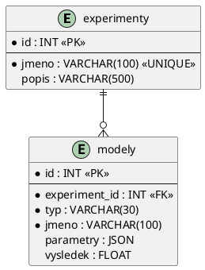

## 5 — Vývoj desktopové aplikace

- [Zadání okruhu (PDF)](../ZadaniOkruhu/SZZVP-SW.pdf)

### Požadované znalosti a dovednosti

- komponenty v ekosystému C# (WPF + XAML) nebo Python (PyQt, Tkinter)
- událostmi řízené programování
- perzistence: databáze (ORM nebo SQL) případně XML/JSON
- asynchronicita a vícevláknové aplikace
- dokumentační komentáře a UML diagramy

### Charakteristika zkušební úlohy

Aplikace s GUI v C# nebo Pythonu, událostmi řízená, objektově navržená, pracující s perzistentními daty a využívající asynchronicitu. Součástí je dokumentace z dokumentačních komentářů a UML diagramy.

### Postup řešení úlohy

Tenhle okruh má tři povinné pilíře, které se nesmí vynechat: **GUI řízené událostmi**, **perzistence** a **asynchronicita**. Zadání je jmenuje všechny tři a hodnotí se každý zvlášť.

**1. Vyber technologii podle zadání.** Když zadání jazyk určuje, drž se ho. Když ne:

- **C# + WPF** — silnější, když se chce datové vazby (binding) a MVVM; XAML je ale zdlouhavější
- **Python + PyQt6** — nejrychlejší cesta k funkčnímu GUI, dobré signály/sloty
- **Python + Tkinter** — jen na malé věci, na obhajobě působí nejslaběji

**2. Nejdřív model a datová vrstva, až potom GUI.** Napiš si třídy domény a úložiště a **vyzkoušej je z konzole**, než postavíš okno. Ladit logiku přes GUI je nejpomalejší možný způsob.

**3. Postav GUI jako tenkou slupku.** V obsluze tlačítka smí být jen: přečti vstup → zavolej službu → zobraz výsledek. Žádný výpočet, žádné SQL. Zkoušející se ptá „šlo by to použít i bez GUI" — správná odpověď je ano.

**4. Asynchronicitu řeš od začátku, ne jako záplatu.** Cokoli, co trvá déle než zlomek sekundy (výpočet, dotaz do DB, HTTP), patří mimo hlavní vlákno. Jinak GUI zamrzne — a to je první věc, kterou zkoušející u obhajoby zkusí.

Tři věci, které k tomu potřebuješ:

- **spuštění na pozadí** — `await Task.Run(...)` v C#, `QThread`/`asyncio` v Pythonu
- **hlášení průběhu** — `IProgress<T>` v C#, signál v PyQt
- **možnost zrušit** — `CancellationToken` v C#, příznak v Pythonu

**5. Perzistence.** Ulož a hlavně **načti při startu** — načítání se zapomíná častěji než ukládání. Ošetři případ, kdy soubor/DB ještě neexistuje.

**6. Dokumentační komentáře** (`///` v C#, docstringy v Pythonu) u všech veřejných tříd a metod. Zadání je jmenuje výslovně a jde z nich vygenerovat dokumentace.

**7. UML diagramy.** Minimálně diagram tříd. Když zbyde čas, sekvenční diagram pro asynchronní operaci — ten se u obhajoby výborně vysvětluje.

**8. Vyzkoušej všechny scénáře v GUI**, včetně těch nepříjemných: prázdný vstup, písmeno místo čísla, zrušení uprostřed výpočtu, dvojklik na tlačítko. Právě tyhle zkusí zkoušející.

### Checklist odevzdání

Společné:

- [ ] funkční aplikace, spustitelná podle README
- [ ] zdrojový kód v **Git repozitáři**, ne ZIP
- [ ] rozumná historie commitů
- [ ] uživatelská příručka — návod na použití
- [ ] komentáře v kódu

Specifické pro tento okruh (přímo z PDF):

- [ ] **GUI řízené událostmi** (ne konzole)
- [ ] **objektový návrh** — oddělené vrstvy, ne všechno v `MainWindow`
- [ ] **perzistence** — databáze nebo XML/JSON, včetně **načtení při startu**
- [ ] **asynchronicita** — dlouhá operace mimo hlavní vlákno, GUI zůstane ovladatelné
- [ ] **dokumentační komentáře** (`///` / docstringy), z nichž jde generovat dokumentace
- [ ] **UML diagramy** (aspoň diagram tříd)
- [ ] u varianty s databází navíc: **stručná dokumentace databáze** (schéma, vztahy)

Body navíc:

- [ ] možnost výpočet **pozastavit a zrušit** (zadání II.1 to chce přímo)
- [ ] ukazatel průběhu (progress bar) napojený na výpočet
- [ ] MVVM (C#) nebo aspoň oddělený ViewModel — dobře se obhajuje

### Pasti a časté chyby

- **Výpočet v obsluze tlačítka.** GUI zamrzne, okno zbělá, Windows nabídne „ukončit aplikaci". Tohle je hlavní hodnocená věc celého okruhu.
- **Aktualizace GUI z jiného vlákna.** Spadne to (`InvalidOperationException` ve WPF, tichý pád v Qt). Musíš přes `Dispatcher.Invoke` / `IProgress<T>` / signál.
- **`async void`** kdekoli jinde než v obsluze události. Výjimka z `async void` se nedá odchytit a shodí aplikaci. Jinde vždy `async Task`.
- **`.Result` nebo `.Wait()` na hlavním vlákně** — způsobí zablokování (deadlock). Vždy `await`.
- **Zapomenuté načtení dat při startu.** Ukládá se, ale po restartu je aplikace prázdná.
- **Nezrušitelný výpočet.** Zadání II.1 chce „přerušit, pozastavit a znovu rozběhnout" — bez `CancellationToken` to nejde udělat čistě.
- **Všechna logika v `MainWindow.xaml.cs`.** Funguje, ale u obhajoby to je jasná ztráta bodů za návrh.
- **Neošetřený vstup.** `int.Parse("abc")` shodí aplikaci. Používej `TryParse`.
- **Chybějící dokumentace databáze** u varianty II.2 — je to samostatná odevzdávaná položka.

### Technické minimum

**C# + WPF:**

```bash
dotnet new wpf -o FraktalniStrom
cd FraktalniStrom
dotnet run
```

Asynchronní výpočet se zrušením a průběhem — tohle je kostra, kterou potřebuješ:

```csharp
private CancellationTokenSource? _cts;

private async void BtnStart_Click(object sender, RoutedEventArgs e)   // async void JEN tady
{
    _cts = new CancellationTokenSource();
    var progress = new Progress<int>(p => ProgressBar.Value = p);     // hlásí zpět do GUI bezpečně

    BtnStart.IsEnabled = false;
    BtnStop.IsEnabled  = true;
    try
    {
        var vysledek = await Task.Run(() => Vypocti(parametry, progress, _cts.Token));
        Vykresli(vysledek);
    }
    catch (OperationCanceledException)
    {
        StatusText.Text = "Výpočet zrušen uživatelem.";
    }
    finally
    {
        BtnStart.IsEnabled = true;
        BtnStop.IsEnabled  = false;
    }
}

private void BtnStop_Click(object sender, RoutedEventArgs e) => _cts?.Cancel();
```

**Python + PyQt6:**

```bash
pip install PyQt6
```

```python
from PyQt6.QtCore import QThread, pyqtSignal

class Vypocet(QThread):
    prubeh = pyqtSignal(int)          # signál do GUI vlákna
    hotovo = pyqtSignal(object)

    def __init__(self, parametry):
        super().__init__()
        self.parametry = parametry
        self._zrus = False

    def run(self):                     # běží v jiném vlákně
        for i in range(self.parametry.iterace):
            if self._zrus:
                return
            ...
            self.prubeh.emit(int(100 * i / self.parametry.iterace))
        self.hotovo.emit(vysledek)

    def zrus(self):
        self._zrus = True

# v okně:
self.vlakno = Vypocet(par)
self.vlakno.prubeh.connect(self.progress.setValue)   # signál → slot, přechod vláken je bezpečný
self.vlakno.hotovo.connect(self.vykresli)
self.vlakno.start()
```

**SQLAlchemy (varianta s databází):**

```bash
pip install sqlalchemy pymysql        # nebo psycopg2-binary pro PostgreSQL
```

### Řešení ukázkové úlohy II.1 — Generování fraktálního stromu (C#/WPF)

**Funkční požadavky z PDF:** zadat parametry (iterace, úhel, koeficient zkrácení, barva) · výpočet **zahájit, přerušit, pozastavit a znovu rozběhnout**, aplikace reaguje i během výpočtu · export a import do JSON.

#### Model

```csharp
/// <summary>Parametry generování fraktálního stromu.</summary>
public class ParametryStromu
{
    public int    Iterace     { get; set; } = 10;
    public double UhelStupne  { get; set; } = 25;
    public double Koeficient  { get; set; } = 0.7;   // zkrácení větve v každé úrovni
    public double DelkaKmene  { get; set; } = 120;
    public string BarvaHex    { get; set; } = "#2E7D32";
}

/// <summary>Jedna větev stromu — úsečka s úrovní zanoření.</summary>
public record Vetev(double X1, double Y1, double X2, double Y2, int Uroven);
```

#### Výpočet s podporou zrušení a pauzy

Rekurze je tu přirozená, ale pro zrušitelnost a hlášení průběhu je lepší **iterace po úrovních** — po každé úrovni zkontroluješ token:

```csharp
/// <summary>
/// Vygeneruje větve fraktálního stromu po úrovních.
/// </summary>
/// <param name="p">Parametry stromu.</param>
/// <param name="progress">Hlášení průběhu v procentech.</param>
/// <param name="pauza">Signalizuje pozastavení výpočtu.</param>
/// <param name="token">Umožňuje výpočet zrušit.</param>
public static List<Vetev> Generuj(
    ParametryStromu p, IProgress<int> progress,
    ManualResetEventSlim pauza, CancellationToken token)
{
    var vysledek = new List<Vetev>();
    var aktualni = new List<(double x, double y, double uhel, double delka)>
    {
        (0, 0, -Math.PI / 2, p.DelkaKmene)      // kmen roste vzhůru
    };

    for (int uroven = 0; uroven < p.Iterace; uroven++)
    {
        pauza.Wait(token);                       // pozastavení: čeká, dokud se nepovolí
        token.ThrowIfCancellationRequested();    // zrušení: vyhodí OperationCanceledException

        var dalsi = new List<(double, double, double, double)>();
        foreach (var (x, y, uhel, delka) in aktualni)
        {
            double x2 = x + delka * Math.Cos(uhel);
            double y2 = y + delka * Math.Sin(uhel);
            vysledek.Add(new Vetev(x, y, x2, y2, uroven));

            double rad = p.UhelStupne * Math.PI / 180;
            dalsi.Add((x2, y2, uhel - rad, delka * p.Koeficient));   // levá větev
            dalsi.Add((x2, y2, uhel + rad, delka * p.Koeficient));   // pravá větev
        }
        aktualni = dalsi;
        progress.Report(100 * (uroven + 1) / p.Iterace);
    }
    return vysledek;
}
```

Počet větví roste jako $2^n$ — při 20 iteracích je to přes milion úseček. **To je právě ten důvod, proč to musí běžet asynchronně**, a je to dobrá odpověď na otázku „proč zrovna tahle úloha potřebuje vlákno navíc".

Pauza přes `ManualResetEventSlim`:

```csharp
private readonly ManualResetEventSlim _pauza = new(initialState: true);  // true = běží

private void BtnPauza_Click(object s, RoutedEventArgs e)
{
    if (_pauza.IsSet) { _pauza.Reset();  BtnPauza.Content = "Pokračovat"; }
    else              { _pauza.Set();    BtnPauza.Content = "Pozastavit"; }
}
```

`Reset()` = zavřená brána, vlákno na `pauza.Wait()` čeká. `Set()` = otevřená, běží dál. Elegantní odpověď na „jak jsi udělal pauzu".

#### Vykreslení

```csharp
private void Vykresli(List<Vetev> vetve, string barvaHex)
{
    Platno.Children.Clear();
    var barva = (SolidColorBrush)new BrushConverter().ConvertFrom(barvaHex)!;
    double stredX = Platno.ActualWidth / 2, stredY = Platno.ActualHeight - 20;

    foreach (var v in vetve)
        Platno.Children.Add(new Line
        {
            X1 = stredX + v.X1, Y1 = stredY + v.Y1,
            X2 = stredX + v.X2, Y2 = stredY + v.Y2,
            Stroke = barva,
            StrokeThickness = Math.Max(1, 6 - v.Uroven * 0.4)   // silnější kmen, tenčí větvičky
        });
}
```

#### Export a import JSON

```csharp
/// <summary>Uloží parametry i vypočtené větve do JSON souboru.</summary>
public static void Uloz(string cesta, ParametryStromu p, List<Vetev> vetve)
{
    var data = new { Parametry = p, Vetve = vetve };
    File.WriteAllText(cesta, JsonSerializer.Serialize(data,
        new JsonSerializerOptions { WriteIndented = true }));
}
```

Použij `SaveFileDialog`/`OpenFileDialog` (`Microsoft.Win32`), ne natvrdo zadanou cestu.

#### Diagram tříd

```plantuml
@startuml
class MainWindow {
  -cts: CancellationTokenSource
  -pauza: ManualResetEventSlim
  +BtnStart_Click()
  +BtnStop_Click()
  +BtnPauza_Click()
}
class ParametryStromu { +Iterace; +UhelStupne; +Koeficient; +BarvaHex }
class Vetev <<record>> { +X1; +Y1; +X2; +Y2; +Uroven }
class Generator { {static} +Generuj(p, progress, pauza, token): List<Vetev> }
class JsonUloziste { {static} +Uloz(); {static} +Nacti() }

MainWindow --> Generator : spouští asynchronně
MainWindow --> JsonUloziste
Generator --> ParametryStromu
Generator --> Vetev : produkuje
@enduml
```

### Řešení ukázkové úlohy II.2 — Správa výsledků ML modelů (Python, stručně)

**Funkční požadavky z PDF:** experiment (jméno, popis) · model (typ RandomForest/SVC, jméno, popis, ≥3 parametry) · přiřazení modelu k experimentu + výsledek (jedno číslo) · **filtrování podle typu a řazení podle výsledku** · ukládání do relační databáze.

Rozdíl proti první variantě: těžiště není ve výpočtu, ale v **datovém modelu a ORM**. Navíc se odevzdává **dokumentace databáze**.

Datový model — 1:N, experiment má více modelů:

```python
from sqlalchemy import create_engine, ForeignKey, String, Float, JSON
from sqlalchemy.orm import DeclarativeBase, Mapped, mapped_column, relationship

class Base(DeclarativeBase): pass

class Experiment(Base):
    """Řešená úloha, do níž patří jeden nebo více modelů."""
    __tablename__ = "experimenty"
    id:     Mapped[int]  = mapped_column(primary_key=True)
    jmeno:  Mapped[str]  = mapped_column(String(100), unique=True)
    popis:  Mapped[str]  = mapped_column(String(500), default="")
    modely: Mapped[list["Model"]] = relationship(back_populates="experiment",
                                                 cascade="all, delete-orphan")

class Model(Base):
    """Konkrétní natrénovaný model a jeho výsledek v rámci experimentu."""
    __tablename__ = "modely"
    id:            Mapped[int]   = mapped_column(primary_key=True)
    experiment_id: Mapped[int]   = mapped_column(ForeignKey("experimenty.id"))
    typ:           Mapped[str]   = mapped_column(String(30))    # RandomForest | SVC
    jmeno:         Mapped[str]   = mapped_column(String(100))
    popis:         Mapped[str]   = mapped_column(String(500), default="")
    parametry:     Mapped[dict]  = mapped_column(JSON)          # n_estimators, max_depth, ...
    vysledek:      Mapped[float] = mapped_column(Float, nullable=True)
    experiment:    Mapped[Experiment] = relationship(back_populates="modely")
```

**Proč `JSON` na parametry:** RandomForest má `n_estimators`, `max_depth`, `criterion`; SVC má `C`, `kernel`, `gamma`. Sloupce pro obojí by znamenaly poloprázdnou tabulku. Alternativa je vertikální tabulka `(model_id, klic, hodnota)` — obojí umět obhájit, je to typická doplňující otázka.

Filtrování a řazení (funkční požadavek 4):

```python
def modely_experimentu(session, exp_id: int, typ: str | None = None, sestupne: bool = True):
    """Vrátí modely experimentu, volitelně filtrované podle typu a seřazené dle výsledku."""
    q = select(Model).where(Model.experiment_id == exp_id)
    if typ:
        q = q.where(Model.typ == typ)
    q = q.order_by(Model.vysledek.desc() if sestupne else Model.vysledek.asc())
    return session.scalars(q).all()
```

Asynchronicita tu má smysl u načítání z databáze — obal dotaz do `QThread`, aby okno neztuhlo, i kdyby byla databáze pomalá. U obhajoby to řekni takhle: *„databázový dotaz je I/O operace s nepředvídatelnou délkou, proto nepatří do GUI vlákna."*

Dokumentace databáze (samostatná odevzdávaná položka):



### Mé řešení úlohy

<!-- Zadání přijde 3–10 dní předem, na řešení je 5 hodin. Sem popis postupu, odkaz na repo, diagramy. -->

### Kostra prezentace (7–10 min)

1. Zadání a funkční požadavky
2. Architektura — vrstvy, UML diagram tříd
3. GUI a jak je řešeno událostmi řízené chování
4. Datová vrstva: schéma a přístup (ORM / SQL / JSON)
5. Asynchronicita — co běží na pozadí a proč (a jak GUI zůstane responzivní)
6. Ukázka běhu aplikace
7. Dokumentace a testování

### Na co se doptají (diskuse po prezentaci)

- Proč musí dlouhý výpočet běžet mimo hlavní vlákno? Co se stane, když ne?
- Jak z pozadí bezpečně aktualizuješ GUI?
- Vysvětli async/await — co se ve skutečnosti děje.
- Co je MVVM a použil jsi ho?
- Data binding — jak funguje?
- Jak ošetříš současný přístup k databázi?

### Užitečné odkazy

- WPF — dokumentace: <https://learn.microsoft.com/cs-cz/dotnet/desktop/wpf/>
- async/await v C#: <https://learn.microsoft.com/cs-cz/dotnet/csharp/asynchronous-programming/>
- PyQt6 dokumentace: <https://www.riverbankcomputing.com/static/Docs/PyQt6/>
- Qt for Python (PySide6) — vlákna a signály: <https://doc.qt.io/qtforpython-6/>
- SQLAlchemy ORM: <https://docs.sqlalchemy.org/en/20/orm/>
- Fractal canopy (zdroj ze zadání): <https://en.wikipedia.org/wiki/Fractal_canopy>
