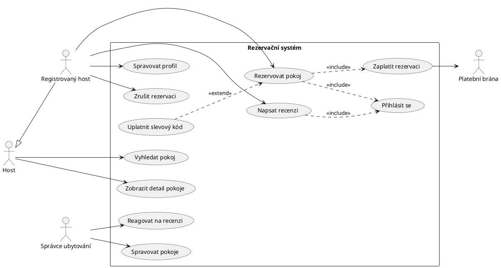
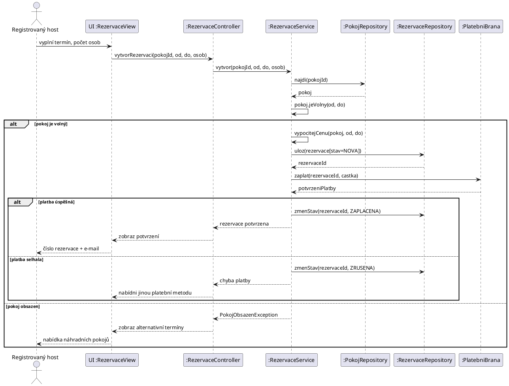
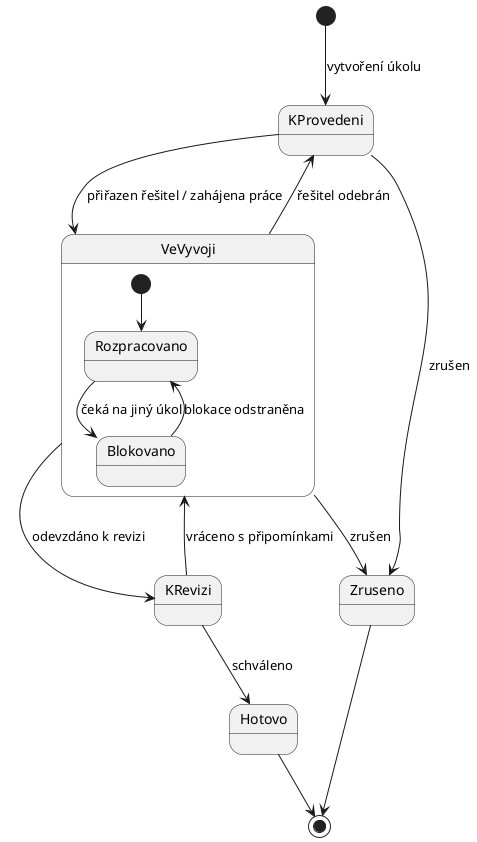
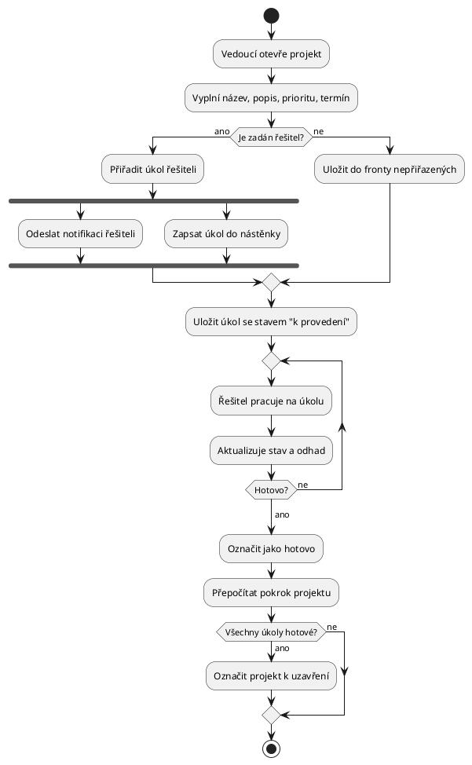

## 8 — Objektově orientovaný návrh

- [Zadání okruhu (PDF)](../ZadaniOkruhu/SZZVP-SW.pdf)

### Požadované znalosti a dovednosti

- fáze tvorby software, stavební bloky jazyka UML
- diagram užití, tříd, objektů, aktivit, stavový, sekvenční, komunikační
- tvorba wireframe modelů GUI a grafických prototypů
- tvorba a generování dokumentace
- analýza požadavků, návrh SW architektury, problematika API

### Charakteristika zkušební úlohy

Systémová dokumentace aplikace v UML plus uživatelský návrh (wireframe nebo grafický prototyp z Figmy). **Povinné diagramy se liší podle varianty zadání** — u rezervačního systému *případů užití + sekvenční + tříd*, u správy projektů *případů užití + aktivit + stavový*. Návrh UI musí obsahovat konkrétní obrazovky vyjmenované v zadání.

### Postup řešení úlohy

Tenhle okruh je z celé osmičky jediný, kde **neodevzdáváš kód**. Odevzdáváš dokumentaci a návrh UI. Nesnaž se nic programovat — hodnotí se úplnost a správnost diagramů.

**1. Podtrhni si v zadání, které diagramy jsou povinné.** Liší se podle varianty a je to první věc, kterou kontrolují:

| Varianta | Povinné diagramy | Povinné obrazovky |
|---|---|---|
| **V.1** rezervační systém | případů užití · **sekvenční** · **tříd** | hlavní stránka · rezervace · profil uživatele · formulář zpětné vazby |
| **V.2** správa projektů | případů užití · **aktivit** · **stavový** | domovská stránka · stránka projektu · přidání úkolu · nástěnka pokroku |

**2. Nejdřív analýza požadavků, teprve pak diagramy.** Projdi zadání a vypiš:

- **aktéry** — kdo se systémem pracuje (host, správce hotelu, platební brána jako externí systém)
- **funkční požadavky** — co systém dělá (FP1: vyhledat pokoj podle data a počtu osob…)
- **nefunkční požadavky** — jak to dělá (odezva do 2 s, GDPR, dostupnost)

Očíslované požadavky jsou zlato: v prezentaci u každého diagramu řekneš, který požadavek pokrývá.

**3. Diagram případů užití jako první.** Je to kostra všeho dalšího. Aktéři vlevo, systém jako rámeček, případy užití jako ovály.

**4. Z případů užití odvoď podstatná jména → kandidáti na třídy.** „Uživatel *rezervuje* *pokoj* v *hotelu* a napíše *recenzi*" → `Uzivatel`, `Rezervace`, `Pokoj`, `Hotel`, `Recenze`. Tenhle postup se u obhajoby ptají doslova („jak z případů užití vznikly třídy?").

**5. Diagram tříd** — atributy, metody, **násobnosti** a **správné typy vazeb** (viz pasti níže).

**6. Sekvenční nebo aktivit — podle varianty.** Vyber **jeden klíčový scénář** (vytvoření rezervace) a udělej ho pořádně, ne tři odbyté.

**7. Stavový diagram** dělej pro objekt, který skutečně prochází stavy — `Rezervace` (nová → potvrzená → zaplacená → proběhlá / zrušená) nebo `Ukol` (k provedení → ve vývoji → hotovo).

**8. Wireframy.** Figma, draw.io, Balsamiq — cokoli. **Musí tam být všechny obrazovky, které zadání jmenuje**, a musí být zřejmé, jak se mezi nimi chodí. Přidej si šipky navigace, prodáš tím celý návrh.

**9. Sepiš dokumentaci** kolem diagramů: úvod, aktéři, seznam požadavků, popis každého diagramu, návrh architektury a API. Diagramy bez textu jsou poloviční práce.

### Checklist odevzdání

Společné:

- [ ] dokumentace jako jeden dokument (PDF nebo README s obrázky)
- [ ] zdrojové soubory diagramů v Git repozitáři (`.puml` je lepší než jen obrázek — je verzovatelný)
- [ ] snímky wireframů / prototypu

Specifické pro tento okruh (přímo z PDF):

- [ ] **všechny povinné diagramy dané varianty** (viz tabulka výše)
- [ ] **všechny povinné obrazovky** návrhu UI
- [ ] analýza požadavků — aktéři, funkční a nefunkční požadavky
- [ ] popis systémové architektury
- [ ] problematika API (endpointy, formát dat)

Body navíc:

- [ ] diagram nasazení nebo komponent — dobře vypadá u „návrhu architektury"
- [ ] provázání: u každého diagramu odkaz na požadavky, které pokrývá
- [ ] slovník pojmů (doménová terminologie)

### Pasti a časté chyby

- **Špatný typ vazby v diagramu tříd.** Nejčastější chyba a nejčastější otázka:
    - **asociace** (plná čára) — objekty spolu jen souvisejí: `Uzivatel` — `Recenze`
    - **agregace** (prázdný kosočtverec) — celek a část, ale část přežije celek: `Tym` ◇— `Zamestnanec` (tým zrušíš, lidé zůstanou)
    - **kompozice** (plný kosočtverec) — část bez celku nemá smysl: `Objednavka` ◆— `PolozkaObjednavky` (smažeš objednávku, položky zmizí)
- **Chybějící násobnosti.** `1`, `0..1`, `1..*`, `*` — bez nich je diagram nedodělaný.
- **Dědičnost všude.** `Rezervace` **není** `Uzivatel`. Dědičnost jen tam, kde platí „je typem" (`Student` je `Uzivatel`).
- **Záměna «include» a «extend»:**
    - **«include»** — vždy proběhne, povinná část: *Rezervovat pokoj* «include» *Přihlásit se*
    - **«extend»** — proběhne jen někdy, volitelné rozšíření: *Rezervovat pokoj* «extend» *Uplatnit slevový kód*
    - šipka u «include» míří **od** základního případu k zahrnutému, u «extend» **od** rozšíření k základnímu — obojí zkontroluj, plete se to
- **Případ užití jako krok, ne cíl.** „Kliknout na tlačítko" není případ užití. „Rezervovat pokoj" ano — musí to být cíl aktéra s hodnotou.
- **Systém jako aktér.** Aktér je vně systému. Vlastní databáze aktér není; platební brána ano.
- **Stavový diagram udělaný pro celý systém.** Patří **jednomu objektu**, a přechody musí mít popsané události.
- **Sekvenční diagram bez návratových šipek** a bez čar života (lifelines) — vypadá jako komunikační.
- **Zaměnění diagramu aktivit a sekvenčního.** Aktivit = tok činností a rozhodování (kosočtverce, větvení). Sekvenční = kdo koho volá **v čase**, důraz na zprávy mezi objekty.
- **Vynechaná obrazovka z povinného seznamu** — zadání je jmenuje jmenovitě a snadno se na jednu zapomene.

### Technické minimum

PlantUML — text v repu, obrázek na jeden příkaz:

```bash
plantuml diagramy/*.puml          # vygeneruje PNG vedle zdrojů
plantuml -tsvg diagramy/*.puml    # SVG do dokumentace
```

Bez instalace jde použít online editor: <https://www.plantuml.com/plantuml>

Kostra každého typu diagramu:

```plantuml
@startuml
left to right direction        ' u diagramu užití čitelnější než shora dolů
actor Host
rectangle "Rezervační systém" {
  usecase "Vyhledat pokoj" as UC1
}
Host --> UC1
@enduml
```

### Řešení ukázkové úlohy V.1 — Rezervační systém pro hotely a penziony

**Povinné:** diagram případů užití, **sekvenční**, **tříd** + wireframy hlavní stránky, rezervace, profilu a formuláře zpětné vazby.

#### Analýza požadavků

**Aktéři:**

| Aktér | Role |
|---|---|
| Host (nepřihlášený) | vyhledává pokoje, prohlíží detaily a recenze |
| Registrovaný host | rezervuje, spravuje profil, hodnotí pobyt |
| Správce ubytování | spravuje pokoje, reaguje na recenze, potvrzuje rezervace |
| Platební brána | *externí systém* — zpracovává platbu |

**Funkční požadavky:**

- FP1 — vyhledání pokojů podle data, počtu osob, ceny a vybavení (wi-fi, snídaně)
- FP2 — zobrazení detailu pokoje včetně fotografií a recenzí
- FP3 — vytvoření rezervace s kontaktními údaji a potvrzením
- FP4 — správa uživatelského profilu, změna hesla
- FP5 — přehled minulých i budoucích rezervací, jejich zrušení a úprava
- FP6 — hodnocení a recenze ubytování
- FP7 — reakce ubytovatele na recenzi
- FP8 — platba kartou, převodem nebo online platformou

**Nefunkční požadavky** (na tyhle se ptají, protože je lidi vynechávají):

- NP1 — odezva vyhledávání do 2 sekund pro 95 % dotazů
- NP2 — hesla uložena hashovaná (bcrypt/Argon2), platební údaje se neukládají
- NP3 — soulad s GDPR, možnost smazání účtu
- NP4 — responzivní rozhraní, mobil i desktop
- NP5 — dostupnost 99,5 %

#### Diagram případů užití



Dvě věci, které tenhle diagram prodává u obhajoby: **dědičnost aktérů** (registrovaný host umí všechno co host, a navíc) a **správně použité «include» vs. «extend»** (přihlášení je povinné, slevový kód volitelný).

#### Diagram tříd

```plantuml
@startuml
class Uzivatel {
  -id: int
  -email: string
  -hesloHash: string
  -jmeno: string
  -telefon: string
  +zmenHeslo(nove: string): void
  +overHeslo(heslo: string): bool
}

class Host
class SpravceUbytovani

class Ubytovani {
  -id: int
  -nazev: string
  -adresa: string
  -popis: string
  +prumerneHodnoceni(): double
}

class Pokoj {
  -id: int
  -cislo: string
  -kapacita: int
  -cenaZaNoc: decimal
  -vybaveni: Vybaveni[]
  +jeVolny(od: Date, do: Date): bool
}

class Rezervace {
  -id: int
  -odDatum: Date
  -doDatum: Date
  -pocetOsob: int
  -stav: StavRezervace
  +celkovaCena(): decimal
  +zrus(): void
}

class Platba {
  -id: int
  -castka: decimal
  -metoda: MetodaPlatby
  -provedena: DateTime
}

class Recenze {
  -id: int
  -hodnoceni: int
  -text: string
  -vytvorena: DateTime
}

class OdpovedNaRecenzi {
  -text: string
  -vytvorena: DateTime
}

class Fotografie {
  -url: string
  -popis: string
}

enum StavRezervace { NOVA \n POTVRZENA \n ZAPLACENA \n PROBEHLA \n ZRUSENA }
enum MetodaPlatby  { KARTA \n PREVOD \n ONLINE_PLATFORMA }

Uzivatel <|-- Host
Uzivatel <|-- SpravceUbytovani

Ubytovani "1" *-- "1..*" Pokoj        : obsahuje
Pokoj     "1" *-- "0..*" Fotografie   : má
Host      "1" -- "0..*" Rezervace     : vytváří
Pokoj     "1" -- "0..*" Rezervace     : je rezervován
Rezervace "1" *-- "0..1" Platba       : je uhrazena
Host      "1" -- "0..*" Recenze       : píše
Ubytovani "1" -- "0..*" Recenze       : je hodnoceno
Recenze   "1" *-- "0..1" OdpovedNaRecenzi
SpravceUbytovani "1" -- "1..*" Ubytovani : spravuje
@enduml
```

Vazby, které umíš obhájit, když se zeptají „proč zrovna tahle":

- `Ubytovani` ◆— `Pokoj` je **kompozice**: pokoj bez hotelu nemá smysl, smazáním hotelu zaniká.
- `Host` — `Rezervace` je **asociace**: rezervace má vlastní životní cyklus a zůstává i po smazání účtu (účetní důvody).
- `Rezervace` ◆— `Platba` **kompozice**: platba bez rezervace neexistuje.
- Násobnost `0..1` u platby: rezervace může být nová a dosud nezaplacená.

#### Sekvenční diagram — vytvoření rezervace



Dva bloky `alt` jsou tam schválně — ošetřené alternativní scénáře (obsazený pokoj, neúspěšná platba) jsou přesně to, co odlišuje promyšlený návrh od odbytého. U obhajoby na ně upozorni sám.

#### Wireframy — co na nich musí být

Zadání jmenuje čtyři obrazovky. Ke každé si připrav jednu větu, čím splňuje který požadavek:

```
┌─────────────────────────────────────────────────────┐
│  HLAVNÍ STRÁNKA                          [Přihlásit]│
├─────────────────────────────────────────────────────┤
│  ┌─────────┬─────────┬────────┬──────────┐         │
│  │ Příjezd │ Odjezd  │ Osoby  │ [Hledat] │  ← FP1  │
│  └─────────┴─────────┴────────┴──────────┘         │
│  Filtry: □ Wi-Fi  □ Snídaně  Cena: [───●───]       │
├─────────────────────────────────────────────────────┤
│  ┌──────┐ Penzion U Lípy         ★★★★☆ (24)        │
│  │ foto │ 2 lůžka · Wi-Fi        1 250 Kč/noc      │
│  └──────┘                        [Detail] [Rezervovat]│
│  ┌──────┐ Hotel Slunce           ★★★★★ (61)        │
│  │ foto │ 3 lůžka · snídaně      1 890 Kč/noc      │
│  └──────┘                        [Detail] [Rezervovat]│
└─────────────────────────────────────────────────────┘
```

```
┌─────────────────────────────────────────────────────┐
│  REZERVACE POKOJE                        ← Zpět     │
├──────────────────────┬──────────────────────────────┤
│  ┌────────────────┐  │  Souhrn                      │
│  │  fotogalerie   │  │  Penzion U Lípy, pokoj 3     │
│  └────────────────┘  │  12.–15. 9. 2026 (3 noci)    │
│  Popis a vybavení    │  2 osoby                     │
│                      │  ──────────────────────      │
│  Vaše údaje          │  3 × 1 250 Kč = 3 750 Kč     │
│  Jméno    [________] │                              │
│  E-mail   [________] │  Platba:                     │
│  Telefon  [________] │  ● Karta ○ Převod ○ Online   │
│  Poznámka [________] │                              │
│                      │  [ Závazně rezervovat ]  ←FP3│
└──────────────────────┴──────────────────────────────┘
```

```
┌─────────────────────────────────────────────────────┐
│  MŮJ PROFIL                                         │
├─────────────────────────────────────────────────────┤
│  [Osobní údaje] [Mé rezervace] [Změna hesla]        │
├─────────────────────────────────────────────────────┤
│  NADCHÁZEJÍCÍ                                  ←FP5 │
│  Penzion U Lípy   12.–15. 9. 2026   Zaplaceno       │
│                        [Upravit]  [Zrušit]          │
│  MINULÉ                                             │
│  Hotel Slunce     3.–5. 6. 2026     Proběhlo        │
│                        [Napsat recenzi]        ←FP6 │
└─────────────────────────────────────────────────────┘
```

```
┌─────────────────────────────────────────────────────┐
│  HODNOCENÍ POBYTU — Hotel Slunce               ←FP6 │
├─────────────────────────────────────────────────────┤
│  Celkové hodnocení   ★ ★ ★ ★ ☆                      │
│  Čistota  ★★★★★   Personál ★★★★☆   Poloha ★★★★★    │
│                                                     │
│  Vaše zkušenost                                     │
│  ┌───────────────────────────────────────────────┐ │
│  │                                               │ │
│  └───────────────────────────────────────────────┘ │
│  □ Zveřejnit pod přezdívkou                        │
│                              [Odeslat hodnocení]    │
└─────────────────────────────────────────────────────┘
```

#### Návrh architektury a API

Třívrstvá architektura: **prezentační** (webové UI) → **aplikační** (REST API, služby) → **datová** (databáze). Odůvodnění pro obhajobu: *„Oddělení vrstev umožňuje vyměnit UI za mobilní aplikaci beze změny logiky — API zůstane stejné."*

```
GET    /api/pokoje?od=2026-09-12&do=2026-09-15&osob=2   200 — vyhledání (FP1)
GET    /api/pokoje/{id}                                 200 / 404 — detail (FP2)
POST   /api/rezervace                                   201 — vytvoření (FP3)
GET    /api/rezervace/{id}                              200 / 403 / 404
DELETE /api/rezervace/{id}                              204 — zrušení (FP5)
GET    /api/uzivatel/profil                             200 / 401
PUT    /api/uzivatel/profil                             200 — úprava (FP4)
POST   /api/ubytovani/{id}/recenze                      201 — recenze (FP6)
POST   /api/recenze/{id}/odpoved                        201 — reakce (FP7)
```

Zásady, kterými to obhájíš: **podstatná jména v množném čísle** pro zdroje, **HTTP metoda nese akci** (ne `/api/vytvorRezervaci`), **stavové kódy** místo chybových hlášek v těle s kódem 200.

### Řešení ukázkové úlohy V.2 — Systém správy projektů (stručně)

**Povinné diagramy jsou jiné:** případů užití + **diagram aktivit** + **stavový diagram**. Obrazovky: domovská stránka, stránka projektu, přidání úkolu, nástěnka pokroku.

Aktéři: člen týmu, vedoucí projektu, správce. Doména: `Projekt` 1—* `Ukol`, `Ukol` *—1 `Uzivatel` (přiřazený řešitel), `Komentar`, `Priloha`.

**Stavový diagram úkolu** — přesně ten objekt, který zadání jmenuje („k provedení", „ve vývoji", „hotovo"):



Vnořený stav `Blokovano` je detail, který se u obhajoby vyplatí — ukazuje, že chápeš složené stavy, ne jen krabičky se šipkami.

**Diagram aktivit** — přidání a zpracování úkolu, včetně rozhodování a paralelních větví:



Rozdíl proti sekvenčnímu diagramu, který se ptají: **diagram aktivit ukazuje tok činností a rozhodování** (větvení, paralelismus přes `fork`), zatímco **sekvenční ukazuje, kdo koho volá v čase** a v jakém pořadí si objekty posílají zprávy. Aktivit je bližší vývojovému diagramu, sekvenční je o komunikaci objektů.

Nástěnka pokroku ve wireframu — kanbanové sloupce odpovídající stavům ze stavového diagramu (tím se ty dva výstupy propojí, a to je přesně to, co chceš u obhajoby ukázat):

```
┌────────────────────────────────────────────────────────┐
│  PROJEKT: Redesign webu        Pokrok: ███████░░░ 68 %  │
├──────────────┬──────────────┬──────────────┬───────────┤
│ K PROVEDENÍ  │  VE VÝVOJI   │  K REVIZI    │  HOTOVO   │
├──────────────┼──────────────┼──────────────┼───────────┤
│ ┌──────────┐ │ ┌──────────┐ │ ┌──────────┐ │ ┌───────┐ │
│ │Ikony     │ │ │Homepage  │ │ │Formuláře │ │ │Analýza│ │
│ │● vysoká  │ │ │◐ střední │ │ │● vysoká  │ │ │       │ │
│ │@Petra    │ │ │@Jan      │ │ │@Petra    │ │ │@Jan   │ │
│ │do 12. 9. │ │ │do 15. 9. │ │ │do 10. 9. │ │ │hotovo │ │
│ └──────────┘ │ └──────────┘ │ └──────────┘ │ └───────┘ │
│  [+ úkol]    │              │              │           │
└──────────────┴──────────────┴──────────────┴───────────┘
```

### Mé řešení úlohy

<!-- Zadání přijde 3–10 dní předem, na řešení je 5 hodin. Sem popis postupu, odkaz na repo, diagramy. -->

### Kostra prezentace (7–10 min)

1. Zadání a analýza požadavků
2. Aktéři a diagram případů užití
3. Diagram tříd — doménový model a proč je rozdělený takhle
4. Sekvenční diagram klíčového scénáře
5. Případně stavový diagram nebo diagram aktivit
6. Wireframy / prototyp jednotlivých obrazovek
7. Návrh architektury a API
8. Shrnutí

### Na co se doptají (diskuse po prezentaci)

- Vysvětli rozdíl mezi asociací, agregací a kompozicí — ukaž na svém diagramu.
- Kdy použiješ «include» a kdy «extend» v diagramu užití?
- Co je na sekvenčním diagramu vidět a co na diagramu aktivit ne?
- Jak z případů užití vznikly třídy?
- Jak bys navrhl API k tomuhle systému?
- Co je funkční a co nefunkční požadavek? Uveď svoje.

### Užitečné odkazy

- PlantUML — dokumentace všech typů diagramů: <https://plantuml.com/>
- PlantUML online editor: <https://www.plantuml.com/plantuml>
- Visual Paradigm — tutoriály k UML: <https://www.visual-paradigm.com/guide/>
- Specifikace UML 2.5.1 (OMG): <https://www.omg.org/spec/UML/2.5.1/About-UML>
- Diagrams.net (dříve draw.io): <https://app.diagrams.net/>
- Figma: <https://www.figma.com/>
